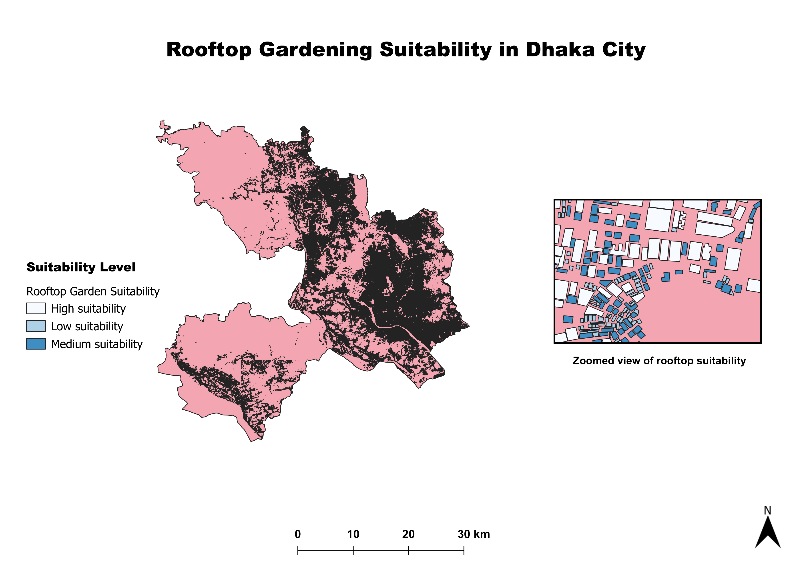

# Urban Ecosystem Enhancement through Rooftop Gardening
## A GIS & Python spatial analysis project estimating rooftop gardening potential and urban ecosystem benefits in Dhaka, Bangladesh.

**Study Area:** Dhaka City, Bangladesh  
**Tools:** QGIS 3.44, Python (GeoPandas, Pandas), OpenStreetMap  

---

## Project Overview
Dhaka City has experienced rapid and largely unplanned urban expansion, resulting in high population density, land-use transformation, and severe pressure on urban ecosystems. The scarcity of open green spaces has intensified environmental challenges such as urban heat island effects, air pollution, and biodiversity loss.

Rooftop gardening offers a nature-based solution by utilizing underused rooftop surfaces to enhance urban ecosystem services. This project presents a GIS-based spatial assessment to identify and evaluate buildings suitable for rooftop gardening across Dhaka City.

---

## Methodology
- Building footprint data were obtained from OpenStreetMap  
- Administrative boundaries were used to spatially clip buildings within Dhaka City  
- Rooftop surface areas were calculated using GIS geometry functions in QGIS  
- A proportion of rooftop area was assumed to be gardenable, considering urban constraints such as accessibility and existing infrastructure  
- Python-based analysis using GeoPandas and Pandas classified buildings into:
  - Low suitability  
  - Medium suitability  
  - High suitability  

---

## Key Outputs

Using GeoPandas geometry calculations, the rooftop surface area of all mapped buildings within Dhaka City was computed.

To reflect real-world feasibility, **30% of each rooftop area was assumed to be gardenable**.  
This conservative assumption accounts for:

- Water tanks and rooftop infrastructure  
- Solar panels and utility installations  
- Access pathways and safety clearance  
- Structural and load-bearing limitations  

### Python Calculation Summary

The analysis workflow in Python included:

- Converting building footprints into projected CRS for accurate area calculation  
- Calculating rooftop area using geometry.area  
- Estimating gardenable area using:

- Aggregating results using Pandas to estimate city-wide potential
- Classifying buildings into suitability categories based on gardenable area thresholds

---

### Quantitative Results

| Metric | Value |
|---|---|
| **Total rooftop area (all buildings)** | **31,420,375 m²** |
| **Estimated gardenable rooftop area (30%)** | **9,426,112 m²** |
| **Equivalent potential green space** | **≈ 9.43 km²** |

---

### Suitability Classification Results

| Suitability Level | Number of Buildings |
|---|---|
| Low suitability | 821,085 |
| Medium suitability | 127,834 |
| High suitability | 16,727 |

These findings highlight the significant untapped potential for rooftop greening across Dhaka City.

## Applications
The analysis supports urban environmental management by:
- Informing green infrastructure planning  
- Supporting urban heat island mitigation strategies  
- Enhancing ecosystem services in dense urban environments  

---

## Technologies Used
- QGIS (Spatial analysis and mapping)  
- Python (GeoPandas, Pandas)  
- OpenStreetMap data  

---

## Repository Structure
- **data/** – Processed spatial datasets (Dhaka boundary, buildings, suitability layers)  
- **notebooks/** – Python (GeoPandas, Pandas) analysis notebook  
- **maps/** – Final GIS map outputs and visualizations  

## Final Map Output

